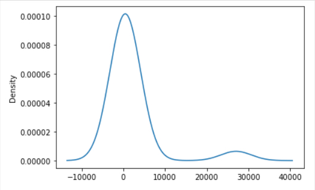
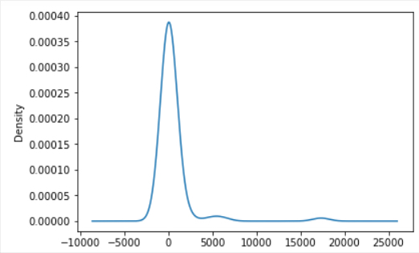
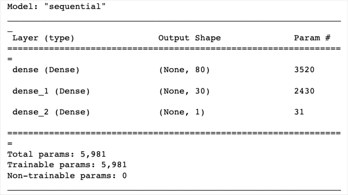
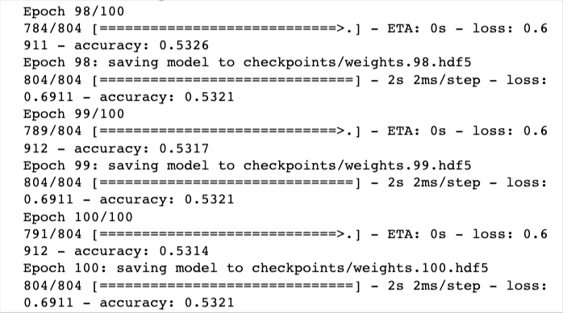
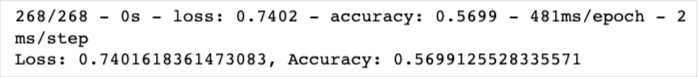

# Neural_Network_Charity_Analysis

This project is about an application of Neurel Network Model to a Charity Analysis.

## Overview:

By the knowledge of machine learning and neural networks, I willl use the features in the provided dataset to to create a binary classifier that is capable of predicting whether applicants will be successful if funded by Alphabet Soup. The dataset is 

The CSV file contains more than 34,000 organizations that have received funding from Alphabet Soup over the years. Within this dataset are a number of columns that capture metadata about each organization, such as the following:

> EIN and NAME—Identification columns
> 
> APPLICATION_TYPE—Alphabet Soup application type
> 
> AFFILIATION—Affiliated sector of industry
> 
> CLASSIFICATION—Government organization classification
> 
> USE_CASE—Use case for funding
> 
> ORGANIZATION—Organization type
> 
> STATUS—Active status
> 
> INCOME_AMT—Income classification
> 
> SPECIAL_CONSIDERATIONS—Special consideration for application
> 
> ASK_AMT—Funding amount requested
> 
> IS_SUCCESSFUL—Was the money used effectively
> 

The purpose of the work is to create a Neurel Network Model to predict the success of each record acccording to the geven features in the dataset and to optimize the model.

## Results:

### Data Preprocessing

**1.** The variable which is considered as target of the model is success, given as 'IS_SUCCESSFUL' column.

**2.** Numerical features are 'ASK_AMT' and 'STATUS'. Categorical features are 'APPLICATION_TYPE','AFFILIATION','CLASSIFICATION','USE_CASE','ORGANIZATION', 'INCOME_AMT'and 'SPECIAL_CONSIDERATIONS'.
The categorical features 'APPLICATION_TYPE' and 'CLASSIFICATION' have more than 10 values in the original data set so I reduced the number of values by using the following codes: 

For 'APPLICATION_TYPE'
>
>APPLICATION_TYPE_counts=application_df.APPLICATION_TYPE.value_counts()
>
> replace_types = list(APPLICATION_TYPE_counts[APPLICATION_TYPE_counts < 500].index)
>
> for typ in replace_types:
>   application_df.APPLICATION_TYPE = application_df.APPLICATION_TYPE.replace(typ,"Other")
>
I decideded the boundary of the rare values to put others by using the plot.density() method, the graph is as follows.

For 'CLASSIFICATION'
>
> CLASSIFICATION_counts=application_df.CLASSIFICATION.value_counts()
> 
> replace_classes = list(CLASSIFICATION_counts[CLASSIFICATION_counts < 1800].index)
>
> for clas in replace_classes:
>    application_df.CLASSIFICATION = application_df.CLASSIFICATION.replace(clas,"Other")
>
I decideded the boundary of the rare values to put others by using the density graph which is the following.

After the number of values raduced , the categorical features are encoded by ***OneHotEncoder*** as follows.

> enc = OneHotEncoder(sparse=False)
>
> encode_df = pd.DataFrame(enc.fit_transform(application_df[application_cat]))
>
>encode_df.columns = enc.get_feature_names(application_cat)
>

An then I merged one-hot encoded features and drop the originals by using the following codes

> application_df = application_df.merge(encode_df,left_index=True, right_index=True)
>
> application_df = application_df.drop(application_cat,axis=1)
>
**3.** The columns 'EIN' and "NAME' are dropped, because they do not have any effect on the success; so they are neither feature nor target. The code is the following:

> application_df=application_df1.drop(['EIN','NAME'],axis=1)

The preprocessed data is siplitted into features and target arrays by

> y = application_df["IS_SUCCESSFUL"].values
> 
> X = application_df.drop(["IS_SUCCESSFUL"],axis=1).values

The arrays are  siplitted into tarining and testing dataset by

> X_train, X_test, y_train, y_test = train_test_split(X, y, random_state=78)

Finally, the StandardScaler instance is created, X_train is fitted by it and X_train and X_test are scaled by

>scaler = StandardScaler()
>
>X_scaler = scaler.fit(X_train)
>
>X_train_scaled = X_scaler.transform(X_train)
>
>X_test_scaled = X_scaler.transform(X_test)

### Compiling, Training and Evaluating the Model

**1.** 2 hidden layers and one output layer are selected in the Neurel Network Model, in the first hidden layer 80 neurons and in the second hidden layer 30 neurons are selected. for hidden layers activation function is selected as 'relu', because numbers are all positive in features; and in the output layer the there is only one neuron and the activation function is selected as 'sigmoid' because the results are supposed to be 0 or 1. The model is defined by

> number_input_features = len(X_train[0])
> 
> hidden_nodes_layer1 = 80
> 
> hidden_nodes_layer2 = 30
>
> nn = tf.keras.models.Sequential()
>
> nn.add(
    tf.keras.layers.Dense(units=hidden_nodes_layer1, input_dim=number_input_features, activation="relu")
)
>
> nn.add(tf.keras.layers.Dense(units=hidden_nodes_layer2, activation="relu"))
>
> nn.add(tf.keras.layers.Dense(units=1, activation="sigmoid"))

You can find the model summary in the following:

In the training the code I have used 100 epochs, see in the following

> fit_model = nn.fit(X_train,y_train,epochs=100,callbacks=[cp_callback])

The evaluation of the model is given by 

> model_loss, model_accuracy = nn.evaluate(X_test_scaled,y_test,verbose=2)
> 
> print(f"Loss: {model_loss}, Accuracy: {model_accuracy}")

